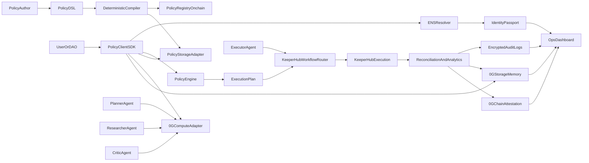

# Architecture

## Trust boundaries
- **Mainnet ENS** provides identity, role metadata, and authorization attestations.
- **PolicyRegistry** anchors canonical policy hashes and active status.
- **0G Storage memory** persists encrypted swarm context and execution artifacts. Optional remote indexer upload/download may load `@0gfoundation/0g-storage-ts-sdk` at runtime (not a root npm dependency); see [zerog-storage-sdk-peer.md](./zerog-storage-sdk-peer.md) and [zerog-storage-operators.md](./zerog-storage-operators.md).
- **KeeperHub** executes policy-approved actions with run-level observability.
- **PolicyClient is fail-closed**: dependency or verification failures default to deny.

## Frontend operations surface
- `web/` (Vite + React 18 SPA at https://gctl.vercel.app) provides the primary operator UI for onboarding, policies, runs, swarm state, alerting, team, and evidence views.
- Vercel Functions in `api/ops/*` normalize indexer responses for dashboard consumption; `api/functions/debate-policy.js` runs the LLM-backed policy synthesizer with a deterministic fallback.
- UI defaults to deterministic fallback snapshots (`api/_lib/mock-data.js`) when runtime endpoints are unavailable so trust workflows stay inspectable.
- API and page layers carry explicit `source` semantics (`live` or `fallback`) plus `trustStatus`/`reasonCode`/`recoveryAction` to preserve operator trust and prevent synthetic data confusion.
