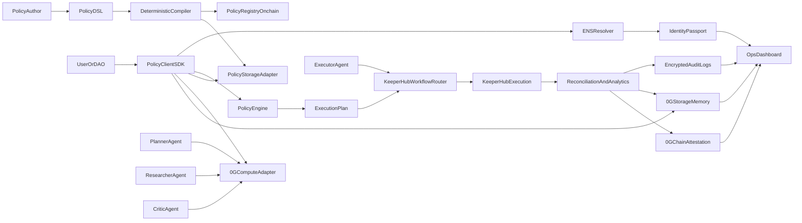

# Architecture

## Trust boundaries
- **Mainnet ENS** provides identity, role metadata, and authorization attestations.
- **PolicyRegistry** anchors canonical policy hashes and active status.
- **0G Storage memory** persists encrypted swarm context and execution artifacts.
- **KeeperHub** executes policy-approved actions with run-level observability.
- **PolicyClient is fail-closed**: dependency or verification failures default to deny.
