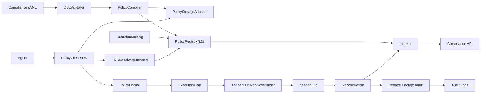

# Architecture

## Trust boundaries
- **Mainnet ENS** is source of policy discovery and agent authorization metadata.
- **L2 PolicyRegistry** anchors policy hash + active state for cheaper policy updates.
- **Storage adapter** stores full policy graph and must match on-chain hash.
- **PolicyClient** is fail-closed: dependency failure always produces deny.
