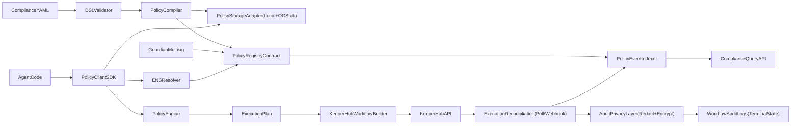

# Institutional Policy OS MVP Plan

## Scope and Outcome
Build a greenfield monorepo that demonstrates end-to-end policy-constrained agent execution:
- Compliance policy authored in YAML and validated against JSON Schema.
- Policy compiled to deterministic `PolicyGraph`, hashed, persisted, and registered on-chain.
- Agent requests resolved through ENS identity/policy discovery.
- Deterministic `ExecutionPlan` mapped to KeeperHub workflows.
- Demo scripts proving small-trade vs large-trade behavior with identical agent logic.
- Contract and SDK controls designed to fail closed and preserve compliance guarantees under external dependency failures.
- Contract and execution layers include emergency circuit breakers, privacy-preserving audit artifacts, and indexable compliance state.

## Architecture (MVP)

## Repository Scaffolding
Create the monorepo layout and baseline tooling:
- Root configs and scripts in [package.json](package.json), [tsconfig.json](tsconfig.json), and [README.md](README.md).
- Solidity contract and deploy scripts in [contracts/PolicyRegistry.sol](contracts/PolicyRegistry.sol) and [scripts/initDemo.ts](scripts/initDemo.ts).
- DSL package with schema/validation in [dsl/schemas/policy.schema.json](dsl/schemas/policy.schema.json), [dsl/src/validate.ts](dsl/src/validate.ts), [dsl/samples/eurofund.mica.yaml](dsl/samples/eurofund.mica.yaml).
- Engine package in [policy-engine/src/types.ts](policy-engine/src/types.ts), [policy-engine/src/compiler.ts](policy-engine/src/compiler.ts), [policy-engine/src/engine.ts](policy-engine/src/engine.ts), [policy-engine/src/storageAdapter.ts](policy-engine/src/storageAdapter.ts).
- SDK package in [agent-sdk/src/client.ts](agent-sdk/src/client.ts), [agent-sdk/src/types.ts](agent-sdk/src/types.ts), [agent-sdk/examples/euro-fund-agent.ts](agent-sdk/examples/euro-fund-agent.ts).
- ENS scripts/config in [ens-identity/config/agents.json](ens-identity/config/agents.json), [ens-identity/scripts/registerAgent.ts](ens-identity/scripts/registerAgent.ts), [ens-identity/scripts/setEnsRecords.ts](ens-identity/scripts/setEnsRecords.ts).
- KeeperHub templates/execution in [keeperhub-workflows/templates/small-trade.json](keeperhub-workflows/templates/small-trade.json), [keeperhub-workflows/templates/large-trade-shielded.json](keeperhub-workflows/templates/large-trade-shielded.json), [keeperhub-workflows/src/buildFromPlan.ts](keeperhub-workflows/src/buildFromPlan.ts), [keeperhub-workflows/src/runDemo.ts](keeperhub-workflows/src/runDemo.ts).
- Reliability/testing modules in [agent-sdk/src/errors.ts](agent-sdk/src/errors.ts), [keeperhub-workflows/src/reconcile.ts](keeperhub-workflows/src/reconcile.ts), [keeperhub-workflows/src/client.ts](keeperhub-workflows/src/client.ts), [keeperhub-workflows/src/client.mock.ts](keeperhub-workflows/src/client.mock.ts), [test/integration/mainnetFork.spec.ts](test/integration/mainnetFork.spec.ts).
- Indexing/query modules in [indexer/ponder.config.ts](indexer/ponder.config.ts), [indexer/src/schema.ts](indexer/src/schema.ts), [indexer/src/policyRegistry.ts](indexer/src/policyRegistry.ts), [indexer/src/reconciliation.ts](indexer/src/reconciliation.ts), [indexer/src/api.ts](indexer/src/api.ts).
- Demo/docs in [scripts/compilePolicy.ts](scripts/compilePolicy.ts), [scripts/demoSmallTrade.ts](scripts/demoSmallTrade.ts), [scripts/demoLargeTrade.ts](scripts/demoLargeTrade.ts), [docs/regulatory-mapping.md](docs/regulatory-mapping.md), [docs/demo-flows.md](docs/demo-flows.md), [docs/architecture.md](docs/architecture.md).

## Implementation Phases

### 1) Hardhat + Contract Baseline
- Initialize Hardhat TS project and contract build/test pipeline.
- Implement `PolicyRegistry` with deterministic `policyId`, `registerPolicy`, `setActive`, and events.
- Add RBAC using OpenZeppelin `AccessControl` (`DEFAULT_ADMIN_ROLE`, `POLICY_ADMIN_ROLE`) so only authorized actors mutate policy state.
- Add OpenZeppelin `Pausable` with `GUARDIAN_ROLE` and emergency `pause/unpause` runbooks.
- Make admin model multisig-friendly (`grantRole` to Safe address, remove deployer role in handover script).
- Add deploy helper consumed by demo scripts.
- Add local Hardhat mainnet-fork config and fixture scripts for ENS-dependent integration tests.
- Add explicit deployment strategy: ENS reads on Ethereum mainnet and `PolicyRegistry` deployed on L2 (default `Base Sepolia` for MVP path, configurable to Arbitrum).

### 2) Policy DSL + Validation
- Define strict JSON Schema matching the requested policy shape.
- Implement YAML parser + AJV validator returning typed `Policy`.
- Enforce semver-style schema field (for example `schema_version: "1.0.0"`) and compiler compatibility matrix.
- Reject deprecated/unknown fields by default and surface actionable validation messages.
- Add sample `eurofund.mica.yaml` and one conservative sample for edge tests.

### 3) Policy Compiler + Persistence
- Implement `compilePolicy(policy) -> PolicyGraph` with stable node ordering.
- Implement canonical JSON hash (`keccak256`) and `persistGraph`.
- Add `LocalFileAdapter` and `OGAdapter` stub implementing same interface; add env switch.
- Implement compile/register script that outputs `policyId`, hash, uri, tx hash.
- Include compiler metadata in persisted graph (`schemaVersion`, `compilerVersion`, `compiledAt`) for audit and migration support.

### 4) Deterministic Policy Engine
- Implement `evaluatePolicy(graph, req)` as pure deterministic logic.
- Enforce whitelist/limits/privacy/routing/reporting/kill-switch behavior exactly per spec.
- Add unit tests for allow/deny boundaries and large-trade branch behavior.
- Add deterministic denial reasons and policy decision trace object for audit replay.

### 5) ENS Identity and Authorization
- Implement ENS record reader for fund (`policy-id`, `policy-registry`) and agent ENSIP-25 key lookup.
- Add optional ERC-8004 verification adapter (real read if address configured, otherwise explicit “stub-verified” mode with warning).
- Add scripts to set ENS text records and verify reads.
- Define agent signer lifecycle: env-injected signer for MVP, documented rotation procedure, and support for hot key swap without SDK redeploy.

### 6) PolicyClient SDK
- Implement `planAction({ fundEnsName, action, callerEnsName })`:
  - resolve ENS metadata,
  - verify agent authorization,
  - fetch on-chain policy hash,
  - load graph from storage and hash-verify,
  - evaluate policy and return `ExecutionPlan`.
- Add example agent CLI showing identical code path for both trade sizes.
- Enforce fail-closed semantics: any ENS lookup failure, malformed record, storage timeout, hash mismatch, or registry read error returns `allowed=false` with explicit error code.
- Add configurable deadlines/timeouts and retry budgets; retries never bypass policy checks.
- Add chain-aware resolution config:
  - ENS provider pinned to mainnet,
  - registry provider pinned to target L2,
  - policy metadata includes `registryChainId`,
  - deny when ENS policy metadata and runtime L2 config mismatch.

### 7) KeeperHub Workflow Mapping and Execution
- Build plan-to-template mapper:
  - `batch-auction` -> `small-trade` workflow,
  - `direct-swap` + private route -> `large-trade-shielded` workflow,
  - append report step when `shouldReport`.
- Integrate real KeeperHub API client with env-configured endpoint/API key.
- Record workflow ID, status, and execution log references.
- Add reconciliation path (polling + optional webhook receiver) to persist terminal states: `succeeded`, `reverted`, `partial_fill`, `timed_out`, `cancelled`.
- Ensure audit log artifact includes request fingerprint, policy hash, execution plan, workflow run IDs, and final outcome.
- Add audit-privacy controls:
  - classify fields as `public`, `restricted`, `secret`,
  - store hashed/obfuscated trade intent in general logs,
  - encrypt sensitive payload fields at rest using KMS-managed key or local envelope encryption adapter for MVP.
- Add deterministic redaction policy so compliance can replay decisions without exposing strategy-sensitive parameters.

### 8) Demo Automation + Docs
- `initDemo.ts`: deploy registry, compile/register policy, set ENS records, print summary.
- `demoSmallTrade.ts`: amount 10,000 -> expected public/CowSwap/no-report plan.
- `demoLargeTrade.ts`: amount 250,000 -> expected private route + report.
- Document quickstart, env vars, and expected outputs in README and demo docs.
- Add regulatory mapping narrative tying DSL controls to MiCA/RTS-6-style controls.
- Add `docs/security-model.md` covering RBAC, key management, fail-closed guarantees, and incident response.
- Add `docs/operations.md` covering pause/unpause drills, guardian escalation, and key rotation SOP.
- Add CI profile docs that run with KeeperHub mocks and forked-chain integration tests.

### 9) Test and Reliability Matrix
- Unit tests: DSL validation, compiler determinism, engine branch coverage, mapper behavior.
- Integration tests (mainnet fork): ENS record resolution, registry hash verification, end-to-end `planAction` deny/allow outcomes.
- Contract tests: role restrictions, role rotation, unauthorized mutation denial.
- Contract tests: guardian pause behavior blocks policy mutation paths; unpause recovers normal operation.
- API tests: KeeperHub mock client deterministic responses for CI; gated live integration tests with real KeeperHub credentials.
- Fault injection tests: ENS missing records, malformed text records, storage adapter timeout, hash mismatch, KeeperHub submission errors.
- Privacy tests: audit redaction/encryption assertions verify no plaintext sensitive fields are persisted.

### 10) Indexing and Compliance Query Layer
- Scaffold Ponder (or Envio) indexer package to ingest `PolicyRegistered`, `PolicyActivated`, `PolicyPaused` and reconciliation events.
- Persist normalized entities for policy versions, active policy per fund, workflow outcomes, and deny reasons.
- Expose a minimal read API for compliance dashboards (`/fund/:ens/policies`, `/workflows/:id`, `/alerts/fail-closed`).
- Add replay script to verify indexed state against on-chain events for audit consistency.

## Acceptance Criteria
- Same agent code produces two different `ExecutionPlan` outputs based only on amount.
- Policy hash in storage matches on-chain registry hash.
- ENS lookup resolves active policy and verifies agent registration record.
- KeeperHub receives different workflows for small vs large trades.
- Demo scripts run sequentially and print reproducible artifacts (policyId/hash/tx/workflow IDs).
- Unauthorized accounts cannot register/deactivate policies; role-guard tests pass.
- Guardian pause can halt policy mutation paths instantly; emergency playbook tested in CI.
- Any critical dependency failure in `PolicyClient` results in explicit deny (fail closed), never implicit allow.
- Reconciliation captures terminal workflow state and links it to policy/action artifacts.
- CI can run deterministically with KeeperHub mocks; fork-based integration tests validate live ENS resolution logic.
- DSL schema version is mandatory and compiler rejects incompatible versions with clear migration errors.
- Audit persistence stores sensitive execution parameters only in redacted/encrypted form; plaintext leakage tests pass.
- ENS-mainnet plus L2-registry configuration is validated by integration tests and mismatched chain metadata is denied.
- Indexer-backed query API can return policy/workflow history without direct high-volume RPC scans.